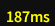
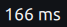

<p align="center">
  
</p>

# True Ping

A [Dalamud](https://dalamud.dev) plugin for FFXIV that shows your **true ping**: the real
application round-trip the game server actually answers, with **jitter** and **packet loss**,
not the operating system's network latency.

It measures latency by timing the game's own **keepalive handshake** (the client sends a
keepalive, the server echoes it back). Because it reads the game protocol itself, it reports
the latency you genuinely feel **even when you route through a proxy or VPN** such as ExitLag.
Naive ping tools read the OS socket RTT; with a local proxy that socket points at `127.0.0.1`,
so they show a meaningless ~0 ms or the wrong endpoint. True Ping doesn't have that problem.

## Why the number is different, and why it is the right one

The same moment, measured three ways:

<p align="center">
  
  &nbsp;&nbsp;&nbsp;
  
  &nbsp;&nbsp;&nbsp;
  
</p>

<p align="center">
  <sub>a typical ping plugin &nbsp;·&nbsp; a VPN / GPN readout &nbsp;·&nbsp; <b>True Ping</b></sub>
</p>

Several numbers get called "ping", and they are not the same thing:

- **Other ping displays measure the network layer.** They send a probe to the server, or read the
  operating system's estimate of the connection's round-trip, and show how long that takes. It is
  measured to whatever address the OS exposes, and it stops at the network: it does not include
  the server receiving your action, processing it, and answering.
- **A VPN or GPN shows its own leg.** That is its best-case, optimized route to the server. It is
  naturally the lowest of the three, and a product has every reason to show it low.
- **True Ping times the game's own keepalive:** a real packet your client sends and the real reply
  the server sends back, on the exact connection you are playing on. That is the complete
  round-trip your gameplay lives with, end to end, which is why it reads a little higher. It
  includes the part you actually feel.

The gap matters most the moment you route through a proxy, VPN or GPN. The network-layer tools
break there: your game socket points at a local address, so they report a meaningless near-zero
or quietly fall back to probing a guessed endpoint over a different route, while the VPN shows only
its own leg. True Ping keeps working, because it reads the game's own packets wherever they travel.
It is the only one of the three still measuring the path your actions actually take.

And because it watches every keepalive, it puts **jitter** and **packet loss** right next to the
number, so a spike to 600 ms cannot hide behind a calm average.

## Features

- **True application-layer ping** from the FFXIV keepalive round-trip.
- **Jitter** (latency stability) and **packet loss** (timed-out keepalives), over a configurable window.
- Average / min / max alongside the current value.
- A floating, lockable **overlay** with an optional **minimal mode** (current ping only), plus a **server info bar** entry (top-right, by the clock).
- Works through proxies/VPNs (ExitLag, Mudfish, NoPing, WTFast and similar) where OS-level ping tools fail.
- No game signatures: it hooks the stable Winsock exports, not patch-specific game functions.

## Commands

| Command | Effect |
|---|---|
| `/trueping` | Opens the configuration window |
| `/trueping overlay` | Toggles the floating overlay |
| `/trueping dtr` | Toggles the server info bar entry |
| `/trueping reset` | Clears the statistics |

## A note on update rate

The keepalive fires every few seconds on each connection, so True Ping refreshes roughly every
couple of seconds, not many times a second. It is **accurate, not high-frequency**, and that is
deliberate: the keepalive is the only round-trip the game exposes that the server actually
answers, which is what makes it the *true* ping rather than an estimate. The overlay greys the
reading out if no keepalive has arrived recently.

## Installing

Requirements: [XIVLauncher](https://goatcorp.github.io/) with Dalamud enabled.

1. In game, type `/xlsettings` and open the **Experimental** tab.
2. Under **Custom Plugin Repositories**, paste the URL below into an empty box:

   ```
   https://raw.githubusercontent.com/doomzao/plugins/main/repo.json
   ```

3. Click the **+** button on the right, then **save** at the bottom right.
4. Open `/xlplugins`, search for **True Ping**, and install it.

### Building from source

Requires the [.NET 10 SDK](https://dotnet.microsoft.com/download/dotnet/10.0).

```powershell
dotnet build -c Release
```

Then, in game:

1. `/xlsettings`, then the **Experimental** tab, then **Dev Plugin Locations**.
2. Add the path `...\true-ping\TruePing\bin\Release\TruePing.dll` and save.
3. `/xlplugins`, then **Dev Tools**, then **Installed Dev Plugins**, and enable True Ping.

## Known limitations

- **Updates only as often as the keepalive fires** (every few seconds). See the note above.
- **The reading depends on the FFXIV frame layout.** If a patch ever reshapes the low-level
  packet header, or the keepalive frame's shape, the parser would need its constants adjusted;
  they are isolated in `FfxivFrame.cs` and documented in `.dev/UPDATING.md`. This has been stable
  for years.
- **Capture relies on the game using the standard Winsock stack.** It hooks `recv`, `send`,
  `WSARecv` and `WSASend`; if the game ever moved off those entirely, capture would need a new
  hook point. The config window's diagnostics show whether keepalives are being observed.
- **Game or Dalamud updates can break the plugin entirely** until updated. True for every plugin.

## License

[AGPL-3.0-or-later](LICENSE)
